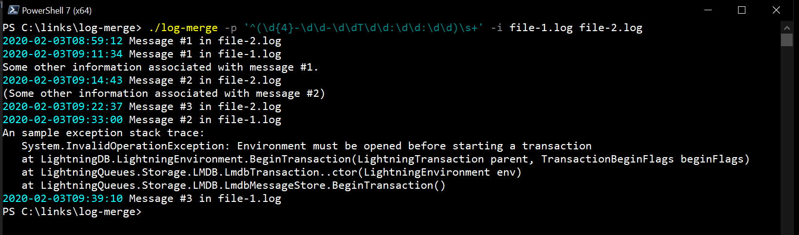

# log-merge
This .NET 3.1 Core console application takes multiple log files, parses them into sets of lines with a header matching a given pattern, and then recombines them into a single, ordered (by date in the header) stream of entries.

For instance, given the following two files:

`file-1.log`
```
2020-02-03T09:11:34 Message #1 in file-1.log
Some other information associated with message #1.
2020-02-03T09:33:00 Message #2 in file-1.log
An sample exception stack trace:
   System.InvalidOperationException: Environment must be opened before starting a transaction
   at LightningDB.LightningEnvironment.BeginTransaction(LightningTransaction parent, TransactionBeginFlags beginFlags)
   at LightningQueues.Storage.LMDB.LmdbTransaction..ctor(LightningEnvironment env)
   at LightningQueues.Storage.LMDB.LmdbMessageStore.BeginTransaction()
2020-02-03T09:39:10 Message #3 in file-1.log
```

`file-2.log`
```
2020-02-03T08:59:12 Message #1 in file-2.log
2020-02-03T09:14:43 Message #2 in file-2.log
(Some other information associated with message #2)
2020-02-03T09:22:37 Message #3 in file-2.log
```

Then, the following command:
```
./log-merge -p '^(\d{4}-\d\d-\d\dT\d\d:\d\d:\d\d)\s+' -i file-1.log file-2.log
```

...would generate the following output:
```
2020-02-03T08:59:12 Message #1 in file-2.log
2020-02-03T09:11:34 Message #1 in file-1.log
Some other information associated with message #1.
2020-02-03T09:14:43 Message #2 in file-2.log
(Some other information associated with message #2)
2020-02-03T09:22:37 Message #3 in file-2.log
2020-02-03T09:33:00 Message #2 in file-1.log
An sample exception stack trace:
   System.InvalidOperationException: Environment must be opened before starting a transaction
   at LightningDB.LightningEnvironment.BeginTransaction(LightningTransaction parent, TransactionBeginFlags beginFlags)
   at LightningQueues.Storage.LMDB.LmdbTransaction..ctor(LightningEnvironment env)
   at LightningQueues.Storage.LMDB.LmdbMessageStore.BeginTransaction()
2020-02-03T09:39:10 Message #3 in file-1.log
```

...with the combined log entries in date order.  Note that the pattern passed as a command-line parameter included a regex capture group that captures the date (and is used to order the combined log entries).

Also, if the output is not being redirected to a file, then the "header" parts of the message (i.e., the part that matched the regex pattern) will be written in cyan text (in order to more easily distinguish where each message begins).  This can be disabled using the `--no-color` command-line parameter.


